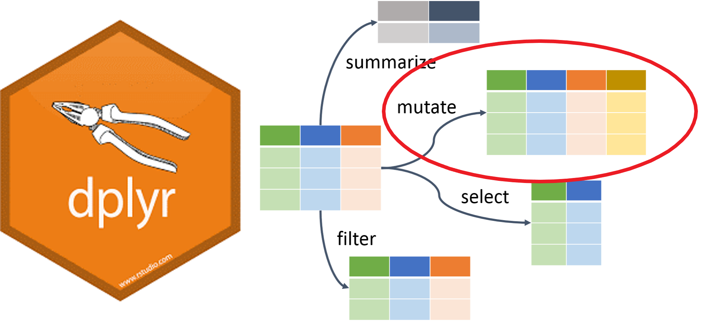
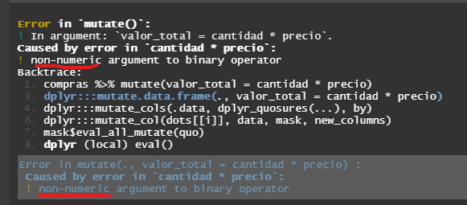

class: center, middle

.linea-superior[]
.linea-inferior[]


## INE Educa: Clases abiertas de R

## Proyecto Ciencia de Datos

## Herramientas de edición de datos I 


```{r setup, include=FALSE}
options(htmltools.dir.version = TRUE)
knitr::opts_chunk$set(message = FALSE, warning = F, eval = T) 
options(scipen = "999")
options(knitr.table.format = "html")

```

```{r xaringan-themer, include=FALSE, warning=FALSE}
library(xaringanthemer)
library(dplyr)
library(magrittr)
library(kableExtra)
```
 

---

name: diapo-basica
background-image: url("imagenes/fondo2.PNG")
background-size: contain;
background-position: 100% 0%

# Edición de datos I
---

template: diapo-basica

Ya sabemos filtrar tablas para quedarnos con lo que necesitamos.

--

El siguiente paso es modificar columnas existentes o agregarle nuevas columnas en base a información existente
o externa.

--

Para eso tenemos la función `mutate`.

.center[
]

--

Su sintaxis es la siguiente:

--

```{r, eval=F}
mutate(data.frame, nombre_columna1 = expresion1,
       nombre_columna2 = expresion2, ...)
```


---
template: diapo-basica

## Mutate: crear columna nueva

Para ilustrar la creación de columnas, creemos un dataframe de ejemplo:

```{r, eval=T, echo=T}
compras = tibble(cantidad = c('4', '2', '5'),
                     precio = c(200, 300, 400))
compras
```
--
Queremos crear una columna llamada `valor_total`, que sea la multiplicación de las dos columnas:
--
```{r, eval=F, echo=T}
compras_completo = compras %>% mutate(valor_total = cantidad * precio)

```
--
¿Qué pasó?

--

.center[
]


---
template: diapo-basica
## Mutate: ~~crear columna nueva~~ reemplazar columna existente

Primero debemos asegurarnos que ambas columnas sean numéricas:

```{r}
class(compras$cantidad)
class(compras$precio)

```
--
Transformamos `cantidad` en numérica, para habilitar operaciones de este tipo:

```{r}
compras_numeric = compras %>% mutate(cantidad = as.numeric(cantidad))

```
--
```{r}
class(compras_numeric$cantidad)
class(compras_numeric$precio)

```
---
template: diapo-basica
## Mutate: crear columna nueva

Volvemos a nuestro ejemplo original:
--
```{r, eval=T, echo=T}
compras_completo = compras_numeric %>% mutate(valor_total = cantidad * precio)

```
--
```{r, eval=T, echo=F}
knitr::kable(compras_completo) 

```
---

template: diapo-basica
##Mutate

¿Qué otras cosas podemos hacer?

--

```{r, eval=T, echo=T}

compras_mas_completo = compras_completo %>% mutate(
  valor_cte = 10,
  max_precio = max(precio),
  min_precio = min(precio),
  id_fila = row_number(),
  col_modificada = precio - 100,
  num_digitos = valor_total %>% as.character %>% stringr::str_length()
)

```
--

```{r, eval=T, echo=F}

kable(compras_mas_completo, format = "html", table.attr = "style='width:30%;'") %>%
  kable_classic(full_width = F)
```

--

En resumen, de alguna forma u otra, podemos realizar cualquier modificación que
se nos ocurra a las columnas de la tabla.

--

Las opciones son cientos, por lo que la recomendación es: "Ante la duda, googlear"

---
template: diapo-basica

## Mutate: anexo

Funciones clásicas para transformación de columnas:

- `as.numeric` pasa variable a formato numérico. Filas deben contener solo números para que pueda utilizarse.
- `as.character` pasa variable a formato texto.
- `as.factor` pasa variable a formato factor, práctico en gráficos y eficiente en términos de memoria.
- `as.Date` pasa variable a formato fecha. Filas deben cumplir con formato específico para que puedan ser interpretadas como fechas.
- `toupper` / `tolower`: pasa columna string a mayúsculas/minúsculas, respectivamente.
- `replace_NA`: reemplaza valores nulos (NA) con el valor especificado.
- `round`: redonea columna numérica según la precisión que se ingrese. Por defecto, deja en valor
entero un número decimal.
- `sum/mean/max/min/sd/median`: Obtiene la suma, media, máximo, mínimo, desviación estándar y mediana, respectivamente, de la columna numérica especificada.
- `paste`: concatena los valores de dos columnas string, separadas por un espacio.


---

class: center, middle

.linea-superior[]
.linea-inferior[]


## INE Educa: Clases abiertas de R

## Proyecto Ciencia de Datos

## Herramientas de edición de datos I 

